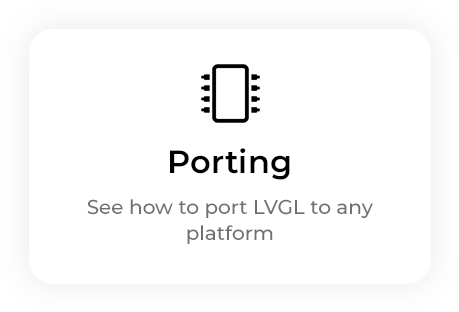
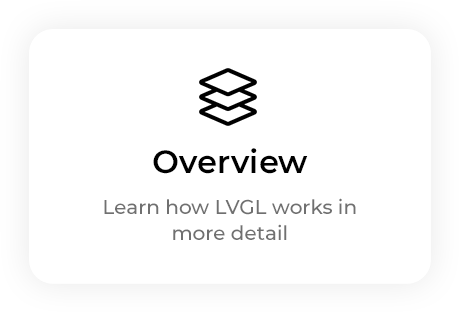
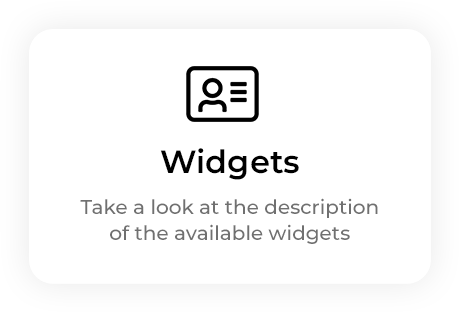
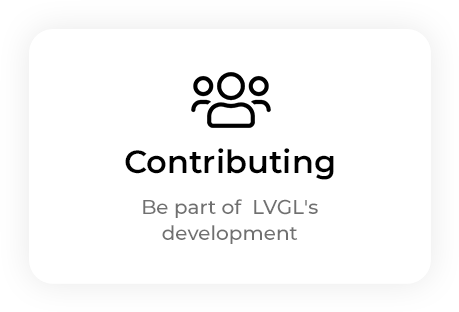

# Welcome to the documentation of LVGL!


<div style="margin-bottom:48px"> 
    <a href="v8.x/intro/index.html"></a>
    <a href="v8.x/get-started/index.html"></a>
    <a href="v8.x/porting/index.html"></a>
    <a href="v8.x/overview/index.html"></a>
    <a href="v8.x/widgets/index.html"></a>
    <a href="v8.x/CONTRIBUTING.html"></a>
</div> 
 

```eval_rst
.. toctree::
   :maxdepth: 2
   
   v8.x/intro/index
   v8.x/get-started/index
   v8.x/porting/index
   v8.x/overview/index
   v8.x/widgets/index
   v8.x/layouts/index
   v8.x/CONTRIBUTING
   v8.x/CHANGELOG
   v8.x/ROADMAP
```


